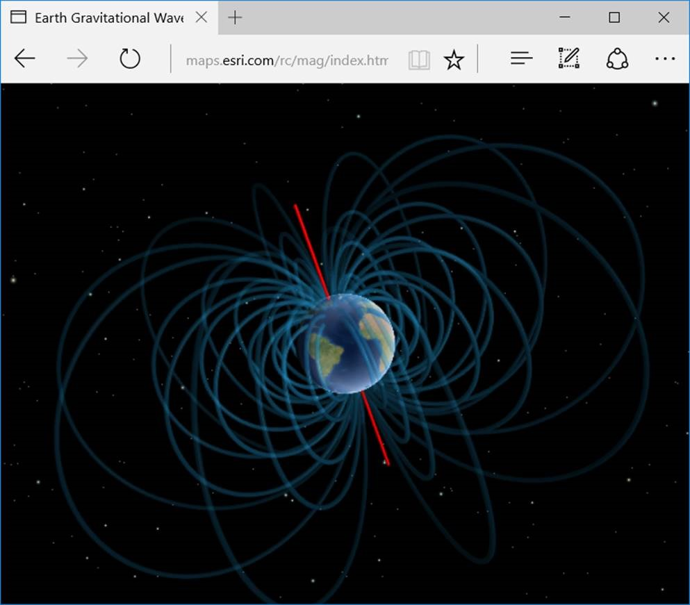

# Esri-Earth-Magnetic-Field
A non-interactive animating globe showing an approximation of the Earth's magnetic field.

Click [here]() to view the live application.

### This application makes use of the following libraries
*   [ArcGIS API for JavaScript](http://developers.arcgis.com/javascript/) by [Esri](http://www.esri.com)
*   [three.js](http://threejs.org/) by [Ricardo Cabello](https://twitter.com/mrdoob) (aka [Mr.doob](https://github.com/mrdoob))

### External Renderers
This application is making use of Esri's external renderer to execute low level webgl commands.

